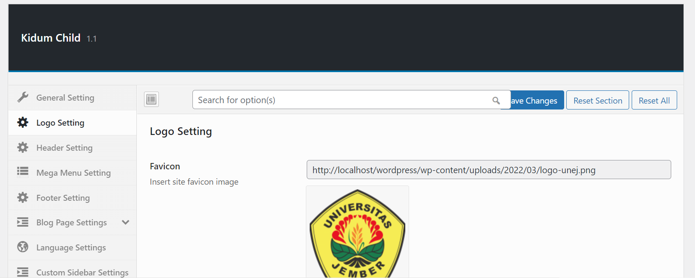
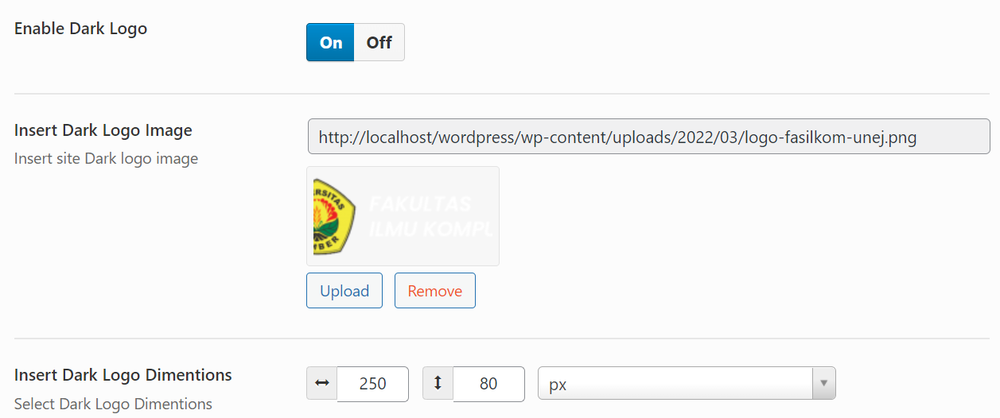
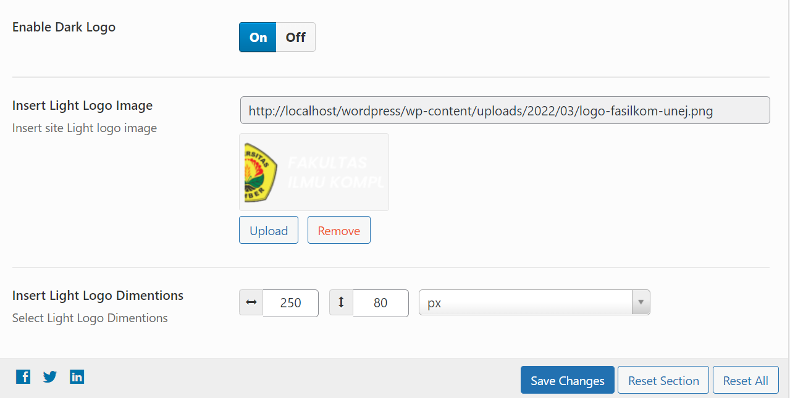
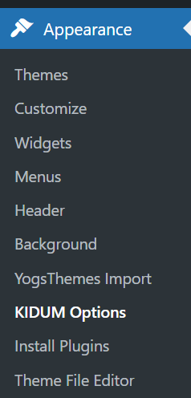
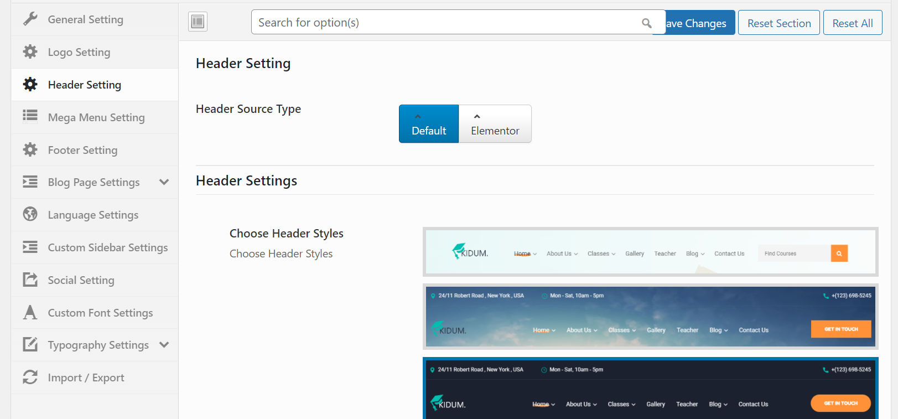
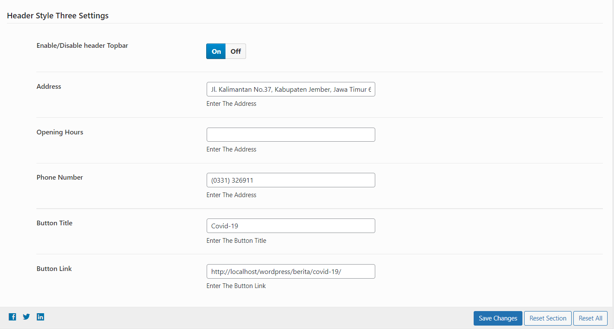
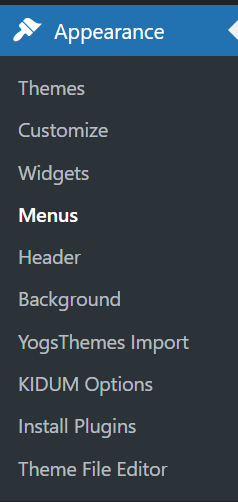
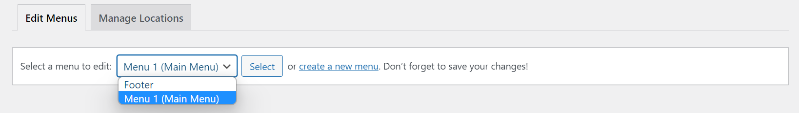
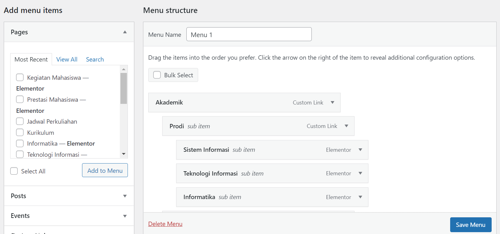

## Logo

Buka URL berikut untuk login sebagai admin `https://olimpiade.leravio.com/auth/adminpanel`

Isikan username dan password seperti berikut:

Username: `adminexam@gmail.com`
Password: `123456`

### Favicon

Jika ingin mengubah favicon bisa klik `Upload`, lalu pilih gambar yang akan dijadikan favicon.

### Dark Logo

Jika ingin non-aktifkan dark logo bisa klik tombol `Off`. Untuk mengubah gambar dari dark logo bisa langsung klik tombol `Upload`. Gambar tersebut bisa disesuaikan ukurannya dengan memasukkan angka pada bagian `width` dan `height` dengan satuan `px`.

### Light Logo

Jika ingin non-aktifkan light logo bisa klik tombol `Off`. Untuk mengubah gambar dari light logo bisa langsung klik tombol `Upload`. Gambar tersebut bisa disesuaikan ukurannya dengan memasukkan angka pada bagian `width` dan `height` dengan satuan `px`.

Terakhir jika sudah tidak ada yang ingin dirubah bisa langsung klik `Save Changes`.

## Topbar

Buka dashboard admin terlebih dahulu, kemudian pilih `Appearance` lalu klik `KIDUM Options`.

Klik `Header Setting` untuk merubah topbar.

Disana terdapat pilihan untuk merubah `Address`, `Opening Hours`, `Phone Number`, `Button Title`, dan `Button Link`.

Terakhir jika sudah tidak ada yang ingin dirubah bisa langsung klik `Save Changes`.

## Navbar

Buka dashboard admin terlebih dahulu, kemudian pilih `Appearance` lalu klik `Menus`.

Pilih `Menu 1 (Main Menu)`.

Ubah Menu dibagian `Menu Structure`.

Terakhir jika sudah tidak ada yang ingin dirubah bisa langsung klik `Save Changes`.

