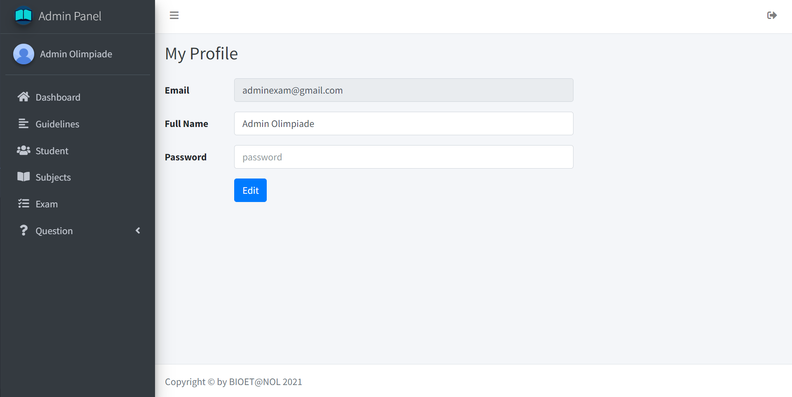

## Login

Buka URL berikut untuk login sebagai admin `https://ujianonline.leravio.com/auth/adminpanel`

Isikan email dan password seperti berikut:

Email: `adminexam@gmail.com`
Password: `123456`

## Tambah Data Admin

Masuk ke dalam menu `Dahsboard`. Setelah itu, klik tombol `More Info` pada bagian `Admin`

Lalu, klik tombol `Add Admin` untuk menambahkan data admin baru

Kemudian, isikan data sesuai form yang diminta. Jika sudah bisa klik tombol `Save` untuk menyimpan data admin baru

## Ubah Data Admin

Pada bagian menu sidebar klik nama `Admin` untuk menuju ke halaman ubah data admin.

Kemudian, isikan data yang ingin diubah sesuai form yang diminta. Jika sudah bisa klik tombol `Edit` untuk mengubah data admin

