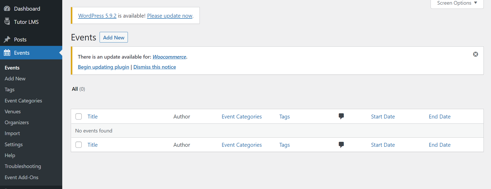
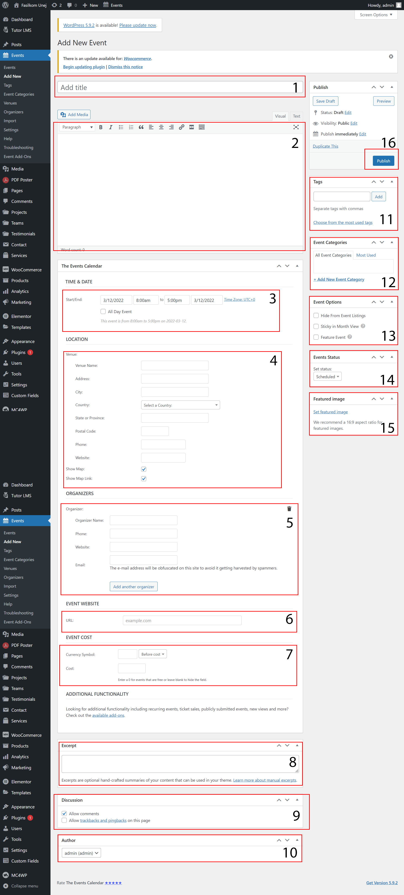

## Tambah Agenda

Buka dashboard admin terlebih dahulu, kemudian pilih `Events` lalu klik `Add New`.

1. Isi `Judul Agenda`.
2. Isi `Deskripsi Agenda`.
3. Isi `Tanggal Awal dan Akhir Agenda`.
4. Isi `Lokasi Agenda`.
5. Isi `Penyelenggara Agenda`. Jika tidak ada boleh dikosongi.
6. Isi `Website Penyelenggara Agenda`. Jika tidak ada boleh dikosongi.
7. Isi `Biaya Pendaftaran Agenda`. Jika tidak ada boleh dikosongi.
8. Isi `Ringkasan Agenda`. Jika tidak diperlukan boleh dikosongi.
9. Centang `Allow Comments`. Jika ingin pengunjung dapat memberikan komentar pada Agenda tersebut.
10. Pilih `Author` yang akan mempublish Agenda tersebut.
11. Isi `Tags Agenda`.
12. Isi `Event Categories`.
13. Centang `Event Options` yang diperlukan.
14. Pilih `Event Status`.
15. Upload `Featured Image`.

## Ubah Agenda

Buka dashboard admin terlebih dahulu, kemudian pilih `Events` lalu cari agenda yang akan diubah. Setelah itu, klik `edit`.

Untuk pengisian atau perubahan agenda bisa dilihat pada gambar `Tambah Agenda` diatas.

## Hapus Agenda

Buka dashboard admin terlebih dahulu, kemudian pilih `Events` lalu cari agenda yang akan dihapus. Setelah itu, klik `trash`.
