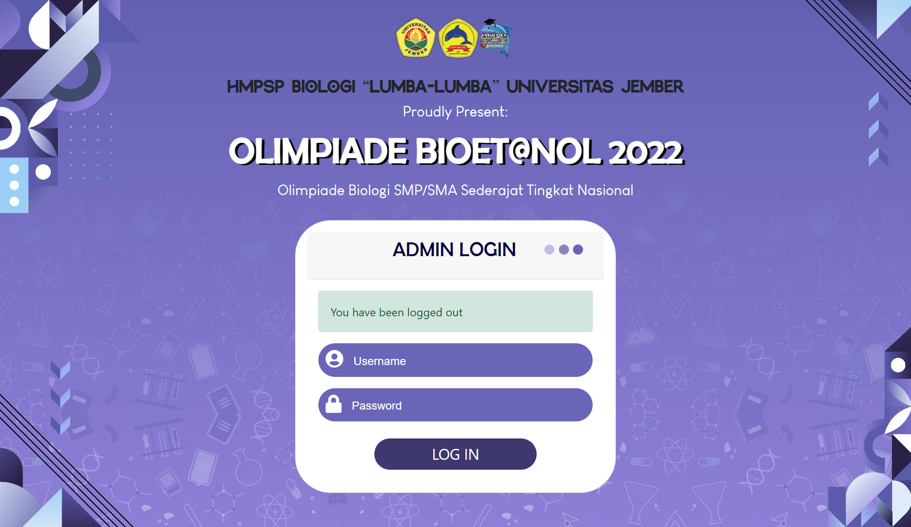
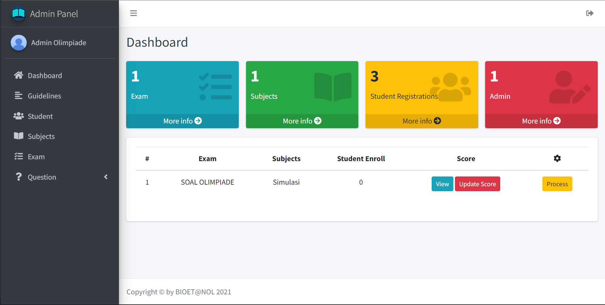
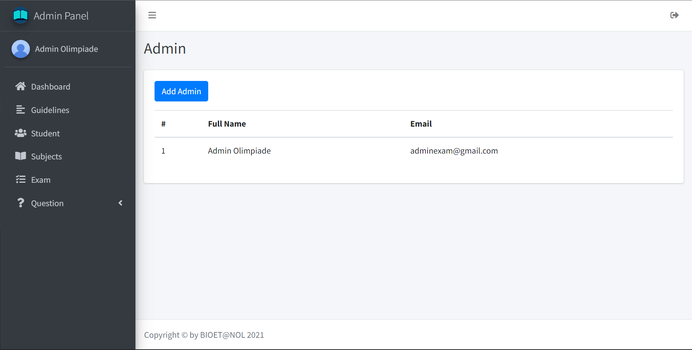
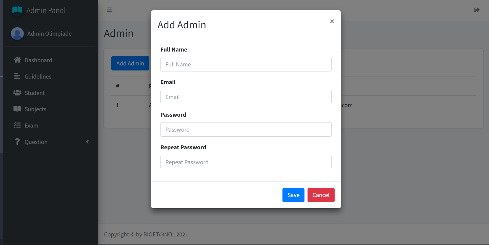

## Login

Buka URL berikut untuk login sebagai admin `https://olimpiade.leravio.com/auth/adminpanel`

Isikan username dan password seperti berikut:

Username: `adminexam@gmail.com`
Password: `123456`

## Tambah Admin

Masuk ke dalam menu `Dahsboard`. Setelah itu, klik tombol `More Info` pada bagian `Admin`

Lalu, klik tombol `Add Admin` untuk menambahkan data admin baru

Kemudian, isikan data sesuai form yang diminta. Jika sudah bisa klik tombol `Save` untuk menyimpan data admin baru

