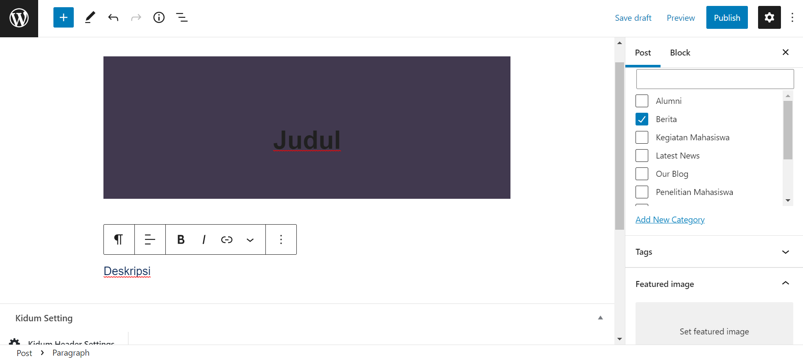
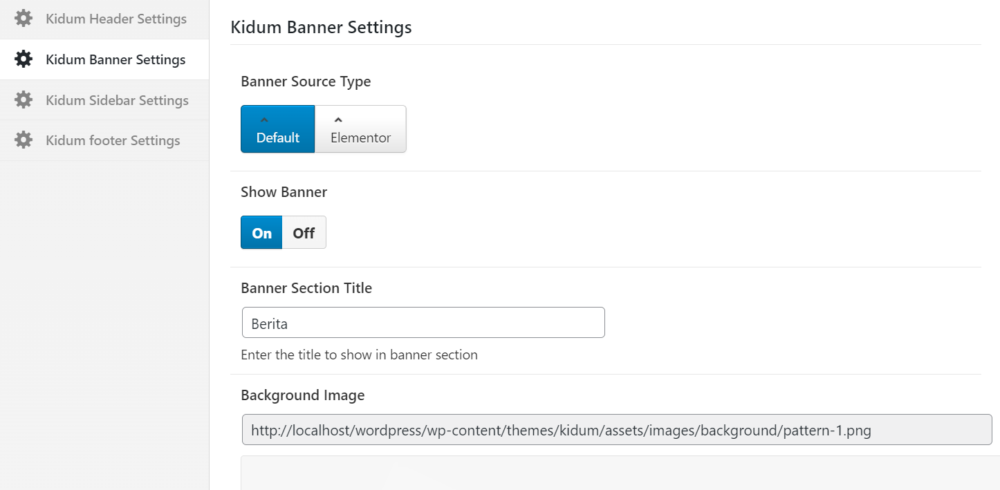
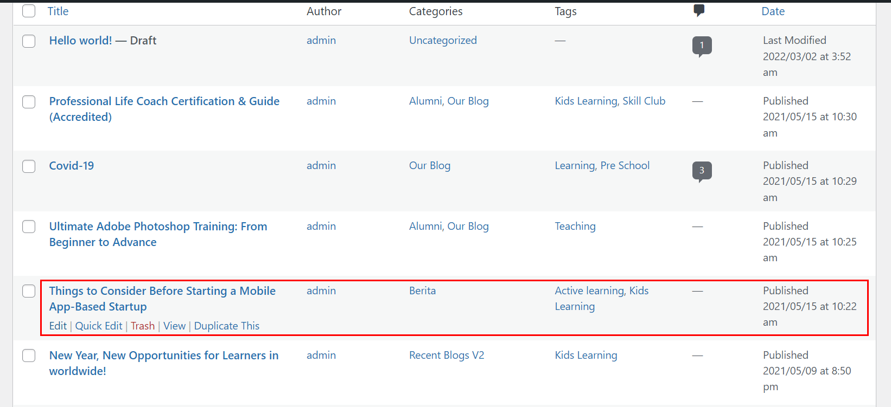

## Tambah Berita

Buka dashboard admin terlebih dahulu, kemudian pilih `Posts` lalu klik `Add New`.

Isi `Judul Berita` dan `Deskripsi Berita`.

Pilih `Post`, lalu cari categories dan kemudian centang `Berita`.

Upload Thumbnail berupa gambar di `Featured Image`.

Lalu scroll ke bawah dan pilih `Kidum Banner Settings`.

Ubah `Banner Source Type` ke `Default`.

Kemudian ubah `Show Banner` ke `On`.

Dan Terakhir isi `Banner Section Title` menjadi `Berita`.

Selanjutnya pilih `Kidum Sidebar Settings`.

Ubah `Sidebar Source Type` ke `Default`.

Kemudian ubah `Layout` seperti gambar dibawah.

Dan Terakhir isi `Sidebar` menjadi `Blog Listing`.

Terakhir jika sudah selesai bisa langsung klik `Publish`.

## Ubah Berita

Buka dashboard admin terlebih dahulu, kemudian pilih `Posts` lalu cari berita yang akan diubah dengan nama `Categories Berita`. Setelah itu, klik `edit`.

Isi bagian `Judul Berita` dan `Deskripsi Berita` jika ingin dirubah.

Terakhir jika sudah tidak ada yang ingin dirubah bisa langsung klik `Update`.

## Hapus Berita

Buka dashboard admin terlebih dahulu, kemudian pilih `Posts` lalu cari berita yang akan dihapus dengan nama `Categories Berita`. Setelah itu, klik `trash`.

