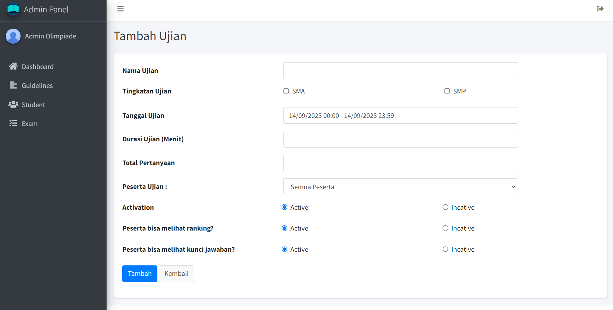
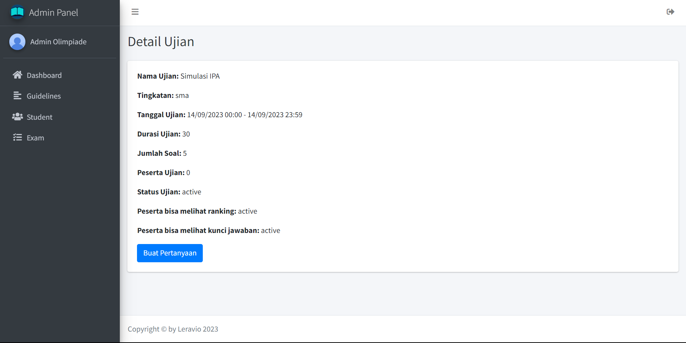
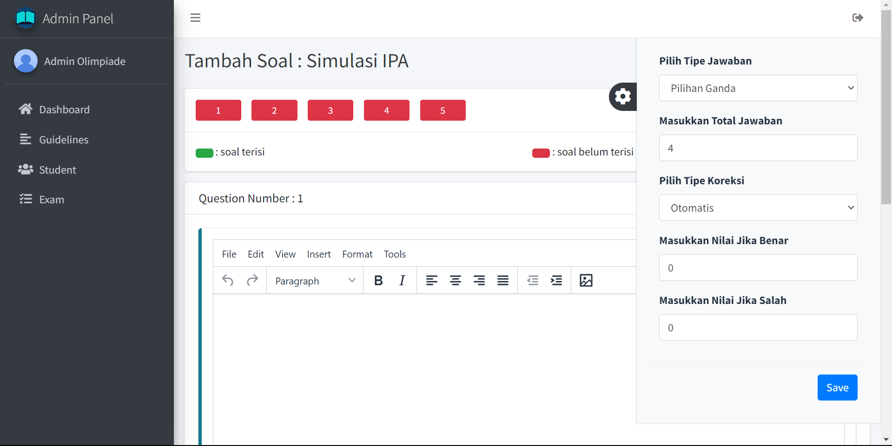

## Tambah Data Exam

Pada bagian menu sidebar klik nama `Exam` untuk menuju ke halaman daftar ujian

Lalu, klik tombol `Tambah Ujian` untuk menambahkan data ujian baru

Kemudian, isikan data sesuai form yang diminta. Jika sudah bisa klik tombol `tambah` untuk menyimpan data ujian baru

## Ubah Data Exam

Pada bagian menu sidebar klik nama `Exam` untuk menuju ke halaman daftar ujian

Lalu, klik icon `Edit` untuk mengubah data exam

Kemudian, isikan data yang ingin diubah sesuai form yang diminta. Jika sudah bisa klik tombol `Ubah` untuk mengubah data exam

## Hapus Data Exam

Pada bagian menu sidebar klik nama `Exam` untuk menuju ke halaman daftar ujian

Lalu, klik icon `Sampah` untuk menghapus data exam

Nanti akan muncul notifikasi untuk menghapus data exam. Kemudian, klik tombol `Delete` untuk menghapus data exam

## Mengatur Soal dan Jawaban

Pada bagian menu sidebar klik nama `Exam` untuk menuju ke halaman daftar ujian

Lalu, klik kolom `Nama Ujian` untuk mengatur soal dan jawaban ujian

Nanti akan muncul detail ujian. Kemudian, klik tombol `Buat Pertanyaan`

Kemudian, isi soal dan jawaban pada kolom yang tertera

Untuk `nilai salah` harus diisi dibawah 1

