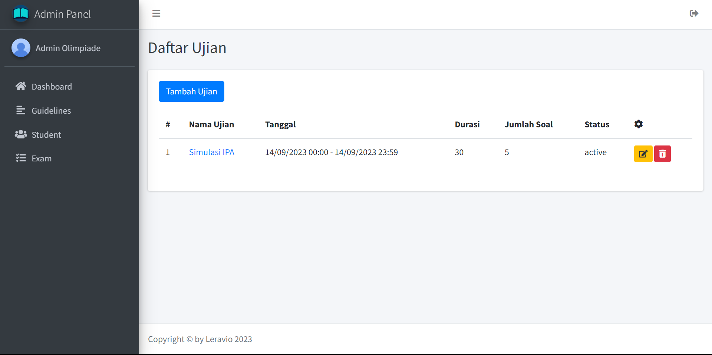
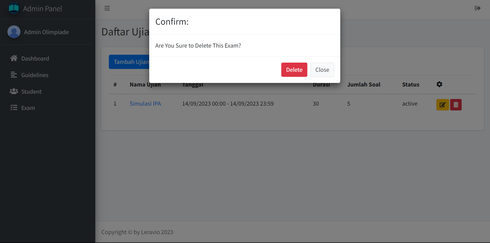

## Tambah Data Exam

Pada bagian menu sidebar klik nama `Exam` untuk menuju ke halaman menambah data exam baru

Lalu, klik tombol `Add Exam` untuk menambahkan data exam baru

Kemudian, isikan data sesuai form yang diminta. Jika sudah bisa klik tombol `Save` untuk menyimpan data exam baru

## Ubah Data Exam

Pada bagian menu sidebar klik nama `Exam` untuk menuju ke halaman menambah data exam baru

Lalu, klik icon `Edit` untuk mengubah data exam

Kemudian, isikan data yang ingin diubah sesuai form yang diminta. Jika sudah bisa klik tombol `Save` untuk mengubah data exam

## Hapus Data Exam

Pada bagian menu sidebar klik nama `Exam` untuk menuju ke halaman menambah data exam baru

Lalu, klik icon `Sampah` untuk menghapus data exam

Nanti akan muncul notifikasi untuk menghapus data exam. Kemudian, klik tombol `Delete` untuk menghapus data exam

