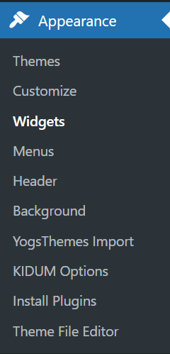
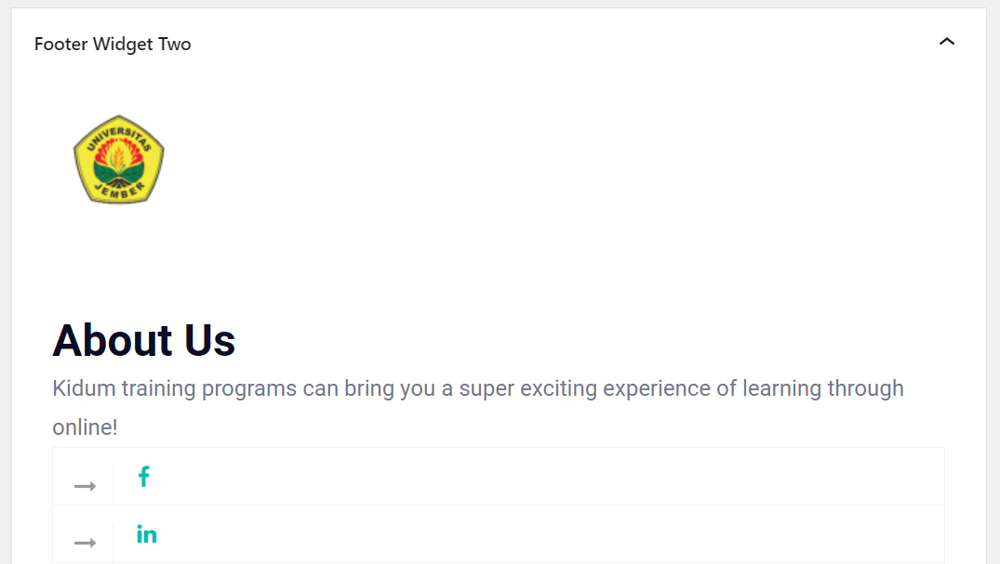

# Footer

Buka dashboard admin terlebih dahulu, kemudian pilih `Appearance` lalu klik `Widgets`.

Lalu scroll ke bawah dan pilih `Footer Widget 2` untuk merubah footer.

Terakhir jika sudah tidak ada yang ingin dirubah bisa langsung klik `Update`.

