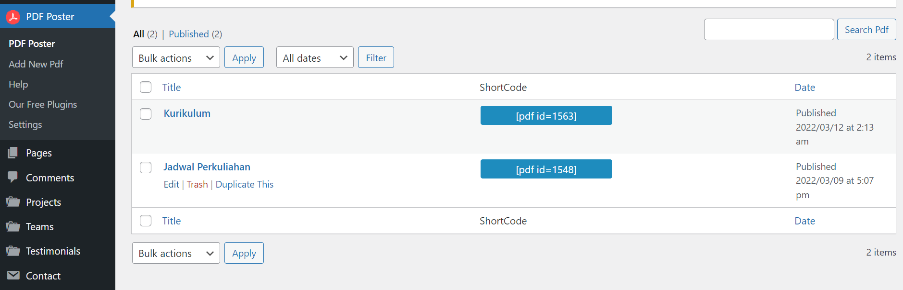
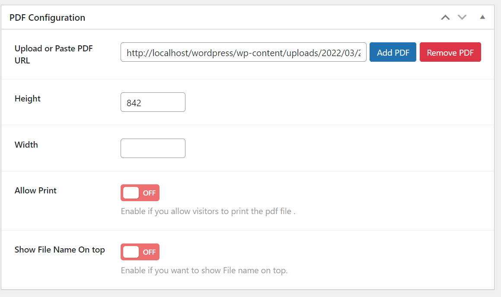

# Jadwal Perkuliahan

Buka dashboard admin terlebih dahulu, kemudian pilih `PDF Poster` lalu klik `Edit` pada `Jadwal Perkuliahan`.

Scroll ke bawah dan cari bagian `PDF Configuration`. Lalu klik `Add PDF` untuk upload jadwal perkuliahan baru dengan format PDF. Jika sudah klik `Update` di bagian atas.

