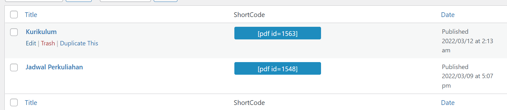

# Kurikulum

Buka dashboard admin terlebih dahulu, kemudian pilih `PDF Poster` lalu klik `Edit` pada `Kurikulum`.

Scroll ke bawah dan cari bagian `PDF Configuration`. Lalu klik `Add PDF` untuk upload kurikulum baru dengan format PDF. Jika sudah klik `Update` di bagian atas.

