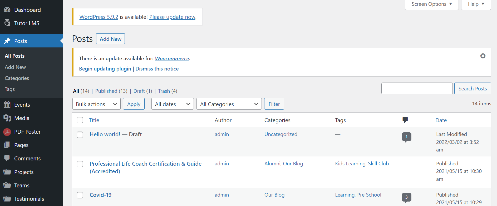
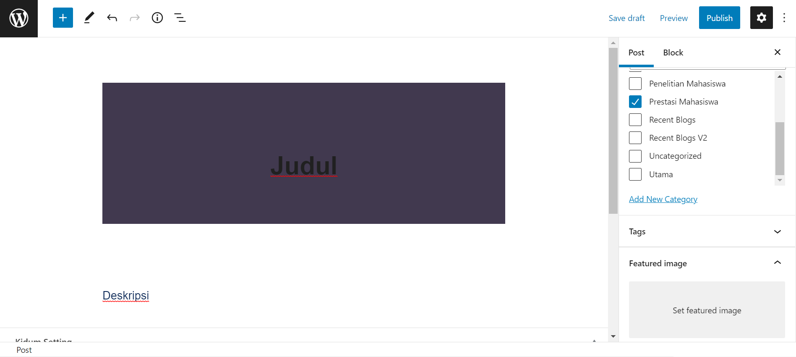
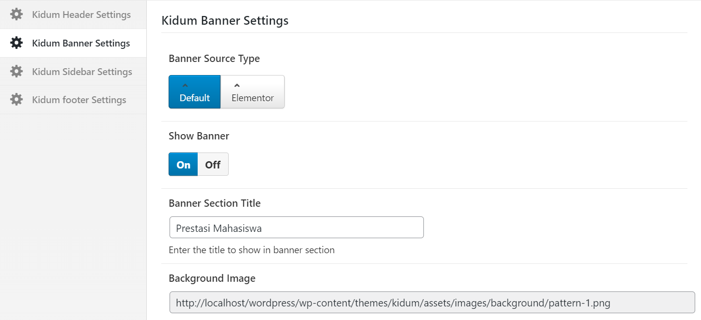
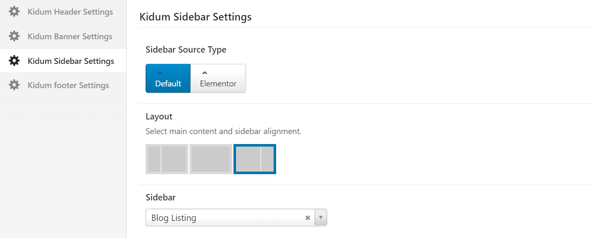
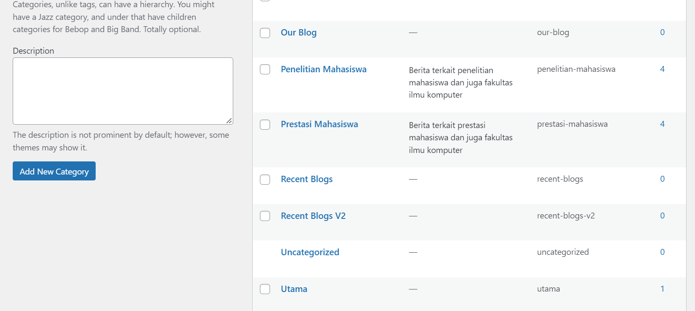
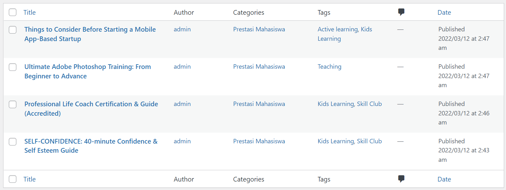
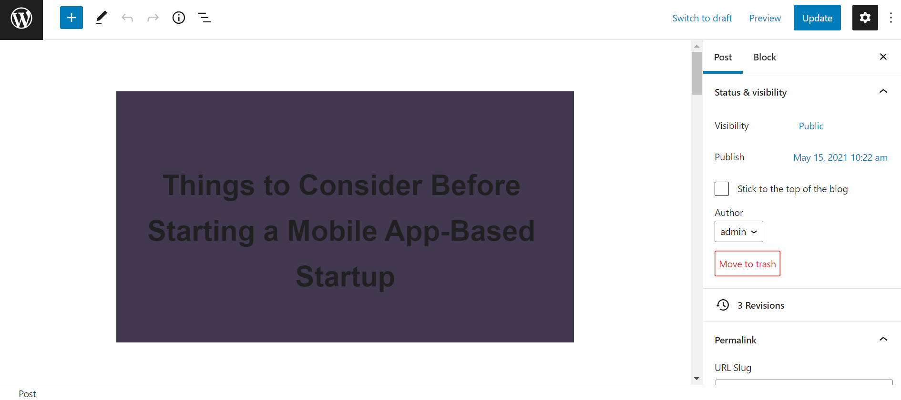

## Tambah Prestasi Mahasiswa

Buka dashboard admin terlebih dahulu, kemudian pilih `Posts` lalu klik `Add New`.

Isi `Judul Prestasi Mahasiswa` dan `Deskripsi Prestasi Mahasiswa`.

Pilih `Post`, lalu cari categories dan kemudian centang `Prestasi Mahasiswa`.

Upload Thumbnail berupa gambar di `Featured Image`.

Lalu scroll ke bawah dan pilih `Kidum Banner Settings`.

Ubah `Banner Source Type` ke `Default`.

Kemudian ubah `Show Banner` ke `On`.

Dan Terakhir isi `Banner Section Title` menjadi `Prestasi Mahasiswa`.

Selanjutnya pilih `Kidum Sidebar Settings`.

Ubah `Sidebar Source Type` ke `Default`.

Kemudian ubah `Layout` seperti gambar dibawah.

Dan Terakhir isi `Sidebar` menjadi `Blog Listing`.

Terakhir jika sudah selesai bisa langsung klik `Publish`.

## Ubah Prestasi Mahasiswa

Buka dashboard admin terlebih dahulu, kemudian pilih `Posts` lalu pilih `Categories`. Selanjutnya cari `Prestasi Mahasiswa` dan klik bagian `Angka` di count

Kemudian akan muncul semua post dengan category Prestasi Mahasiswa. Selanjutnya pilih post yang akan diperbarui.

Isi bagian `Judul Prestasi Mahasiswa` dan `Deskripsi Prestasi Mahasiswa` jika ingin dirubah.

Terakhir jika sudah tidak ada yang ingin dirubah bisa langsung klik `Update`.

## Hapus Prestasi Mahasiswa

Buka dashboard admin terlebih dahulu, kemudian pilih `Posts` lalu pilih `Categories`. Selanjutnya cari `Prestasi Mahasiswa` dan klik bagian `Angka` di count

Kemudian akan muncul semua post dengan category Prestasi Mahasiswa. Selanjutnya pilih post yang akan hapus, lalu klik `Trash` untuk menghapus post tersebut.

