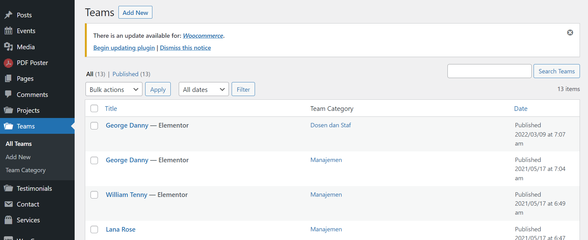
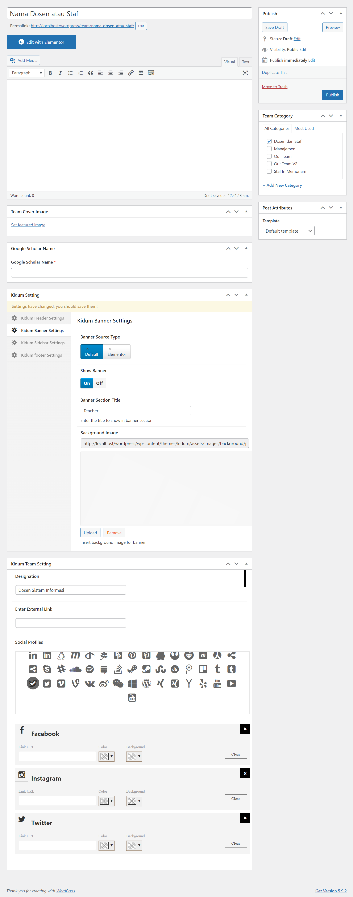

## Tambah Staf dan Dosen

Buka dashboard admin terlebih dahulu, kemudian pilih `Teams` lalu klik `Add New`.

Isi `Nama Staf dan Dosen` dan kosongi bagian `Deskripsi`.

Centang bagian `Staf dan Dosen`.

Upload foto staf dan dosen berupa gambar di `Team Cover Image`.

Isi `Google Scholar Name` jika ada, jika tidak ada bisa dikosongi.

Lalu scroll ke bawah dan pilih `Kidum Banner Settings`.

Ubah `Banner Source Type` ke `Default`.

Kemudian ubah `Show Banner` ke `On`.

Dan Terakhir isi `Banner Section Title` menjadi `Staf dan Dosen`.

Selanjutnya pada bagian `Kidum Team Setting`, isi bagian `Designation` dengan jabatan atau tugas dari staf dan dosen.

Kosongi bagian `Enter External Link`.

Lalu pada bagian `Social Profiles` pilih akun social media yang dimiliki oleh staf dan dosen dan isi link social media yang bersangkutan.

Jika sudah maka bisa klik `Publish`.

