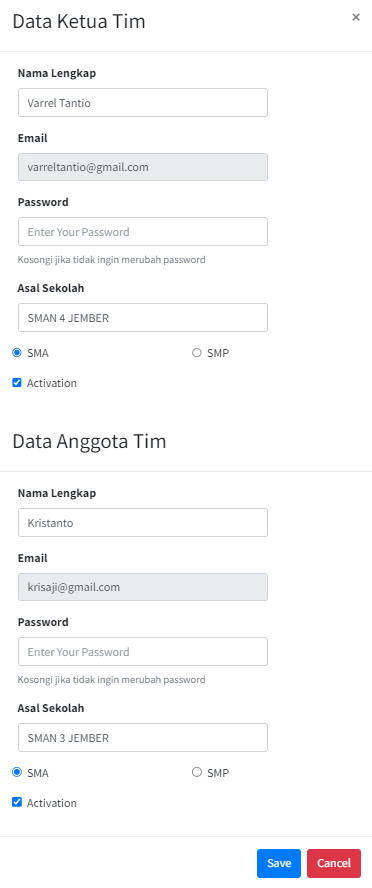

## Tambah Data Peserta

Pada bagian menu sidebar klik nama `Student` untuk menuju ke halaman menambah data peserta baru

Lalu, klik tombol `Tambah Siswa` untuk menambahkan data peserta baru

Kemudian, isikan data sesuai form yang diminta. Jika sudah bisa klik tombol `Save` untuk menyimpan data peserta baru

## Import Data Peserta

Pada bagian menu sidebar klik nama `Student` untuk menuju ke halaman menambah data peserta baru

Lalu, klik tombol `Cara Import` untuk melihat data peserta yang diperlukan

Kemudian, buat file excel yang berisikan kolom seperti gambar di bawah. Jika sudah bisa klik tombol `Close`

Setelah itu, klik tombol `Choose File` untuk memilih file excel yang akan diimport. Kemudian klik tombol `Import` untuk mengimport seluruh data yang ada di file excel

## Ubah Data Peserta

Pada bagian menu sidebar klik nama `Student` untuk menuju ke halaman menambah data peserta baru

Lalu, klik icon `Edit` untuk mengubah data peserta

Kemudian, isikan data yang ingin diubah sesuai form yang diminta. Jika sudah bisa klik tombol `Save` untuk mengubah data peserta

## Hapus Data Peserta

Pada bagian menu sidebar klik nama `Student` untuk menuju ke halaman menambah data peserta baru

Lalu, klik icon `Sampah` untuk menghapus data peserta

Nanti akan muncul notifikasi untuk menghapus data peserta. Kemudian, klik tombol `Delete` untuk menghapus data peserta

