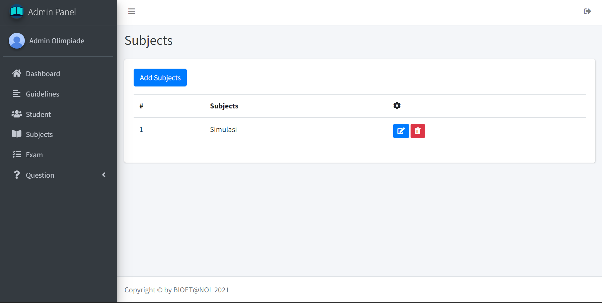
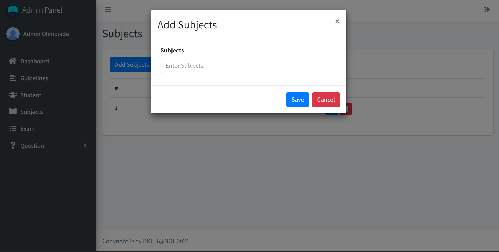

## Tambah Data Subjects

Pada bagian menu sidebar klik nama `Subjects` untuk menuju ke halaman menambah data subjects baru

Lalu, klik tombol `Add Subjects` untuk menambahkan data subjects baru

Kemudian, isikan data sesuai form yang diminta. Jika sudah bisa klik tombol `Save` untuk menyimpan data subjects baru

## Ubah Data Subjects

Pada bagian menu sidebar klik nama `Subjects` untuk menuju ke halaman menambah data subjects baru

Lalu, klik icon `Edit` untuk mengubah data subjects

Kemudian, isikan data yang ingin diubah sesuai form yang diminta. Jika sudah bisa klik tombol `Save` untuk mengubah data Subjects

## Hapus Data Subjects

Pada bagian menu sidebar klik nama `Subjects` untuk menuju ke halaman menambah data subjects baru

Lalu, klik icon `Sampah` untuk menghapus data subjects

Nanti akan muncul notifikasi untuk menghapus data subjects. Kemudian, klik tombol `Delete` untuk menghapus data subjects

